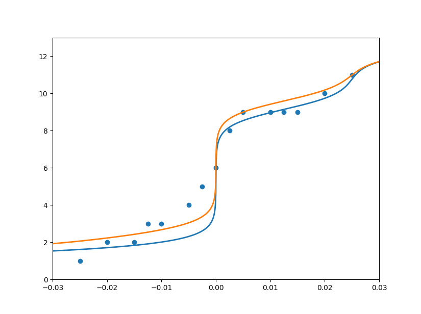

# 关于甘氨酸滴定曲线的讨论
## 一、滴定曲线的数学解析
根据二元弱酸的解离，我们可以列出如下的恒等式

$$
K_1=\frac{[H^+][A^0]}{[A^+]}~~~~~~K_2=\frac{[H^+][A^-]}{[A^0]}
$$

$$
[A^+]+[A^0]+[A^-]=C
$$

$$
[H^+][OH^-]=K_w
$$

其中 $[A]$ 用以表示弱酸，这里就是指的甘氨酸的浓度，$K_1$ 和 $K_2$ 是甘氨酸的两个解离常数，$C$ 指甘氨酸的总浓度，$K_w$ 为水的离子积。以上四个式子已经涉及我们需要求解的 $pH$ 即 $[H^+]$,这时我们只需要引入变量即可求解$pH-x$的曲线即滴定曲线。
注意到电荷守恒在加入盐酸和氢氧化钠的情况下分别有：

$$
[A^+]+[H^+]=[A^-]+[OH^-]+[Cl^-]
$$

$$
[A^+]+[H^+]=[A^-]+[OH^-]-[Na^+]
$$

这时我们就可以将 $+[Cl^-]$ 和 $-[Na^+]$ 等效为 $+x$ ，从而得到下式：

$$
[A^+]+[H^+]=[A^-]+[OH^-]+x
$$

至此我们得到了5个恒等式6个未知数组成的方程组，通过代换的方式我们可以解出 $x$ 关于 $[H^+]$ 略显复杂的函数表达式：

$$
x=\big(\frac{[H^+]}{K_1}-\frac{K_2}{[H^+]}\big)\frac{C}{M}+[H^+]-\frac{K_w}{[H^+]}
$$

其中 $M$ 为：

$$
M=\frac{[H^+]}{K_1}+\frac{K_2}{[H^+]}+1
$$

考虑到 $pH=-lg([H^+])$ , $pK_1=-lg(K_1)$ , $pK_2=-lg(K_2)$ 可以进一步写成 $x$ 关于 $pH$ 的函数表达式 $x=g(pH)$ 如下:

$$
x=g(pH)=\frac{(10^{pK1-pH}-10^{pH-pK_2})~C}{10^{pK1-pH}+10^{pH-pK_2}+1}+10^{-pH}-10^{pH-pK_w}
$$

不难发现我们所得到是 $x$ 关于 $pH$ 的函数，而滴定曲线是 $pH$ 关于 $x$ 的函数，所以我们需要进行反解以得到我们所需要的滴定曲线 $pH=f(x)$ 。然而该函数是不易反解的，注意不是不能反解只是涉及到十分冗长表达式，这是一方面原因；另一方面，我们完全可以通过对换坐标轴实现函数的翻转，并且利用隐函数求导法则我们也可以方便的求得导数关系。
下图为利用 $x=g(pH)$ 画出的理论滴定曲线：


## 二、pH-x函数拟合与结果分析 
我们将 $x=g(pH)$ 中的 $K_1$ 和 $K_2$ 作为需要拟合参数，利用python中scipy包中的curve_fit函数拟合滴定曲线，得到拟合曲线的两个解离常数: 

$$
K_1 = 4.460745332308635
$$

$$
K_2 = 9.150716133669839
$$

下图展示了拟合曲线和理论曲线，蓝线为拟合，橙线为理论。

可以看出我们组所得的数据效果并不好，特别是在加入盐酸的阶段。我们猜想问题是出在了盐酸的添加上，==移液器的使用不熟练导致无法加入正确剂量的盐酸==。
同时，为了证明是我们的操作出现的问题而不是理论曲线的问题，我在此很感谢**█ █ █ 小组**提供了宝贵的数据来验证我们推导的滴定曲线。下图为 █ █ █小组的数据所得到的拟合（蓝）与理论（橙）曲线。


# 附录：代码实现与优化
## 一、代码
1.相关库的导入
```python
from matplotlib.pylab import plt
import numpy as np
import pandas as pd
from scipy import optimize as op
```
2.x-pH函数
```python
def x_pH(ph,pk1=2.34,pk2=9.60,C=0.025,pkw=14):
    M = 10**(pk1-ph)+10**(ph-pk2)+1
    x = (10**(pk1-ph)-10**(ph-pk2))*C/M+10**(-ph)-10**(ph-pkw)
    return -x
```
3.显示数据点和甘氨酸的理论解离曲线
```python
def show_data(data,label,C):
    d = 0.0001 
    start,end = 0,14

    X = np.linspace(start, end, int((end-start)/d),endpoint=True) 
    Y = pd.DataFrame(X)
    Y = Y.apply(lambda i:x_pH(i,C=C)).values #反解真实曲线

    fig, ax = plt.subplots()
    ax.scatter(label,data)  #数据点
    ax.plot(Y, X, linewidth=2.0) #真实曲线
    ax.set(xlim=(-0.03, 0.03),ylim=(0,13))
    plt.show()


    a = np.linspace(4,8,10000000)
    for i in a:
        if abs(x_pH(i))<1e-10:
            print(i)
            break
    print(f'等电点{(9.6+2.34)/2}时加入的当量{x_pH((9.6+2.34)/2)}')
    print(f'pK2时加入的当量{x_pH((9.6))}')
    print(f'pK2时加入的当量{x_pH((2.34))}')
```
4.拟合解离曲线
```python
def show_fit(data,label,C):
    data = np.array(data)
    label = np.array(label)
    pk1,pk2 = op.curve_fit(lambda ph,pK1,pK2:x_pH(ph,pK1,pK2),data,label,bounds=(0, 10))[0]
    print(pk1,pk2)

    d = 0.0001
    start,end = 0,14
    X = np.linspace(start, end, int((end-start)/d),endpoint=True)
    Y = pd.DataFrame(X)
    Y = Y.apply(lambda i:x_pH(i)).values #反解真实曲线
    Yf = pd.DataFrame(X)
    Yf = Yf.apply(lambda ph:x_pH(ph,pk1=pk1,pk2=pk2)).values #拟合曲线

    fig, ax = plt.subplots()
    ax.scatter(label,data)  #数据点
    ax.plot(Yf, X, linewidth=2.0) #拟合曲线
    ax.plot(Y, X, linewidth=2.0) #真实曲线
    ax.set(xlim=(-0.03, 0.03),ylim=(0,13))
    plt.show()
```
5.调用示例
```python
if __name__=="__main__":
    data1 = [3,3.5,4,4.5,5,5.5,5.5,5.5,6.5,7.5,8,9.5,8,9,10]
    data2 = [1,2,2,3,3,4,5,6,8,9,9,9,9,10,11]
    label = [-0.025,-0.02,-0.015,-0.0125,-0.01,-0.005,-0.0025,0,0.0025,0.005,0.01,0.0125,0.015,0.02,0.025]
    C = 0.025 

    data = data2
    show_data(data,label,C)
    show_fit(data,label,C)
```
## 二、代码的进一步优化方案
1.show_data()函数中的零点查找方式效率低下，可以采取采取二分查找、梯度步长查找、牛顿迭代法等方式提高速度，同时也可以从图象数据中直接提取相近的值以省去计算步骤。

2.可以采用面向对象的编程方式来更好的封装代码，这里我只做了初步的封装，可以直接用于相同类型的氨基酸滴定曲线。采用面向对象的编程方式可以减少代码的复用，数据共享，同时便于新功能的引入。

3.图表的美化，简单但重要的一部分。
