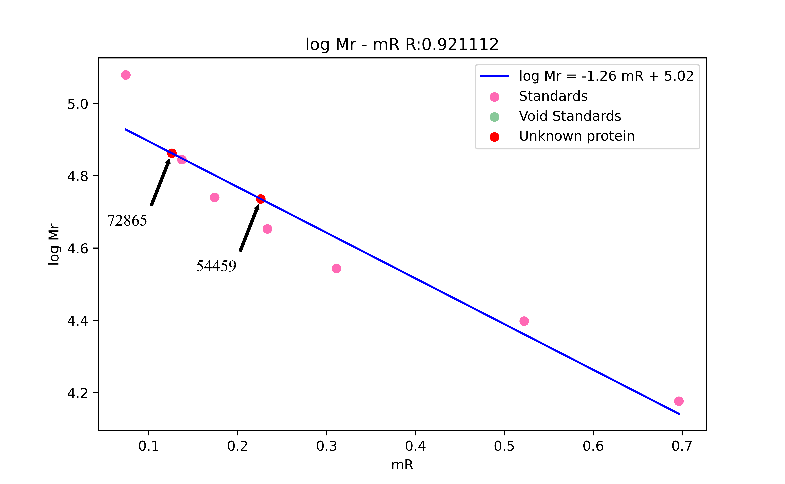
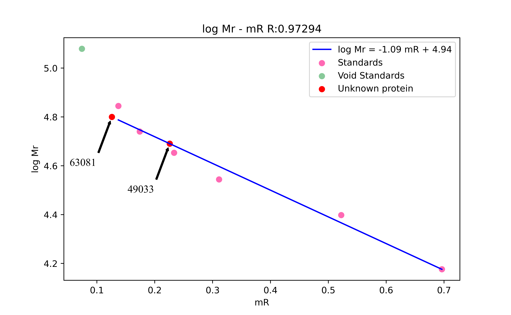

### 四、实验结果

Reynolds J A, Tanford C. The gross conformation of protein-sodium dodecyl sulfate complexes[J]. Journal of Biological Chemistry, 1970, 245(19): 5161-5165.
研究了蛋白质-SDS的构象及其流体动力学性质，给出了迁移速率与分子量线性关系的物理学解释。

$$
log M_r = km_R+b
$$

线性回归结果：

$$ R = 0.9211122455968702$$

$$ d= 5.021750979962017$$

$$ k= -1.2644859064614764$$

由于浓缩胶与分离胶的交界处浓度的过渡性，使得第一条带的迁移距离相对较大，因而舍去第一个点，以标准蛋白的第二条开始作图处理，相关的回归结果如下：

$$ R = 0.9211122455968702$$

$$ d= 4.9376794424195705$$

$$ k= -1.094128762092871$$

$$
第1条带迁移距离为3.4对应分子量为63081
$$

$$
第2条带迁移距离为6.1对应分子量为49033
$$