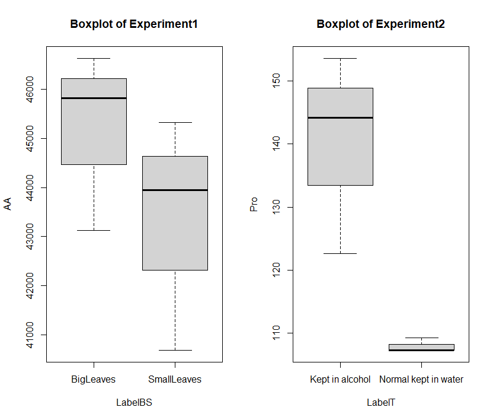

### 1.输入原始数据并根据下列公式计算

$$
{C_a}=\frac{(A-0.0737)44V_样}{0.0054W_样}
$$

$$
{C_脯}=\frac{(A+0.0021)2V_2}{0.0521W}
$$

### 2.利用箱线图进行数据检查

#### 本次实验没有超过四分位距1.5倍的或需要人工筛除的数据,无需进行数据清洗.

### 3.最终结果

### 各组统计性描述如下

大叶
|Min. |1st Qu. | Median  |  Mean |3rd Qu.  |  Max.|
|:---:|:---:|:---:|:---:|:---:|:---:|:---:|:---:|
|43128|   44473|   45817|   45192|   46224|   46632R|

小叶

|Min. |1st Qu. | Median  |  Mean |3rd Qu.  |  Max.|
|:---:|:---:|:---:|:---:|:---:|:---:|:---:|:---:|
|43128|   44473|   45817|   45192|   46224|   46632R|

正常植物叶
|Min. |1st Qu. | Median  |  Mean |3rd Qu.  |  Max.|
|:---:|:---:|:---:|:---:|:---:|:---:|:---:|:---:|
|122.7|   133.4|   144.2|   140.1|   148.9|   153.6|

逆境植物叶
|Min. |1st Qu. | Median  |  Mean |3rd Qu.  |  Max.|
|:---:|:---:|:---:|:---:|:---:|:---:|:---:|:---:|
|107.3|   107.3|   107.3|   108.0|   108.3|   109.2|


### 3.显著性差异检验 Kruskal-Wallis rank sum test 
数据未通过正态性和方差齐性检验，采取非参数检验的方式。
```R
> kruskal.test(list(AA[1:3],AA[4:6]))   #无显著差异

        Kruskal-Wallis rank sum test

data:  list(AA[1:3], AA[4:6])
Kruskal-Wallis chi-squared = 1.1905, df = 1, p-value = 0.2752

> kruskal.test(list(Pro[1:3],Pro[4:6])) #有显著差异

        Kruskal-Wallis rank sum test

data:  list(Pro[1:3], Pro[4:6])
Kruskal-Wallis chi-squared = 3.9706, df = 1, p-value = 0.0463
```

这表明大叶和小叶之间的氨基酸含量**无显著差别**($p-value = 0.2752 > 0.05$)

逆境植物叶和正常植物叶脯氨酸含量**有显著差别**($p-value = 0.0463 < 0.05$).

#
##### 代码详见 https://github.com/Yirios/Data-Analysis-in-Biochemistry/branches
