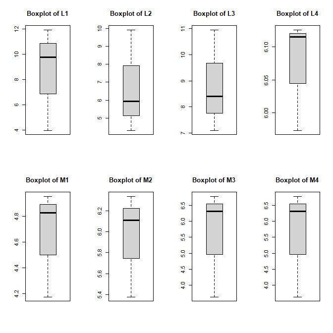
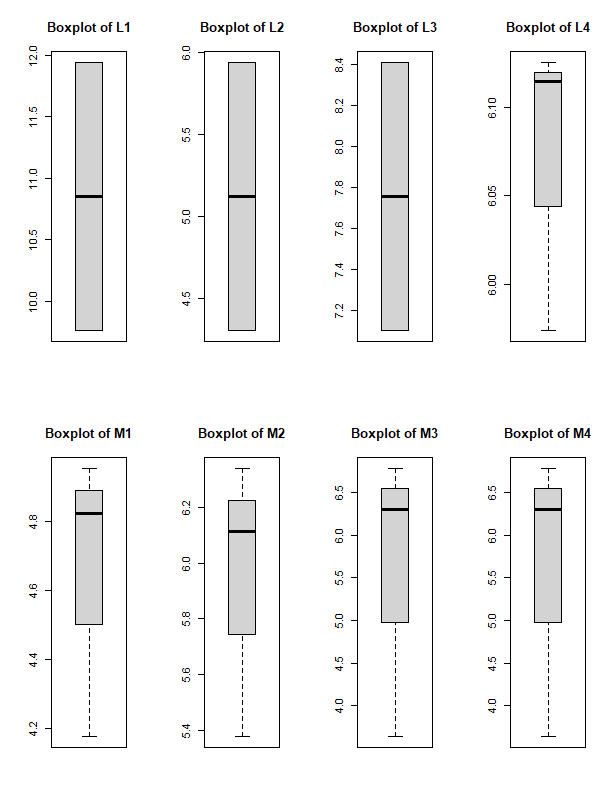
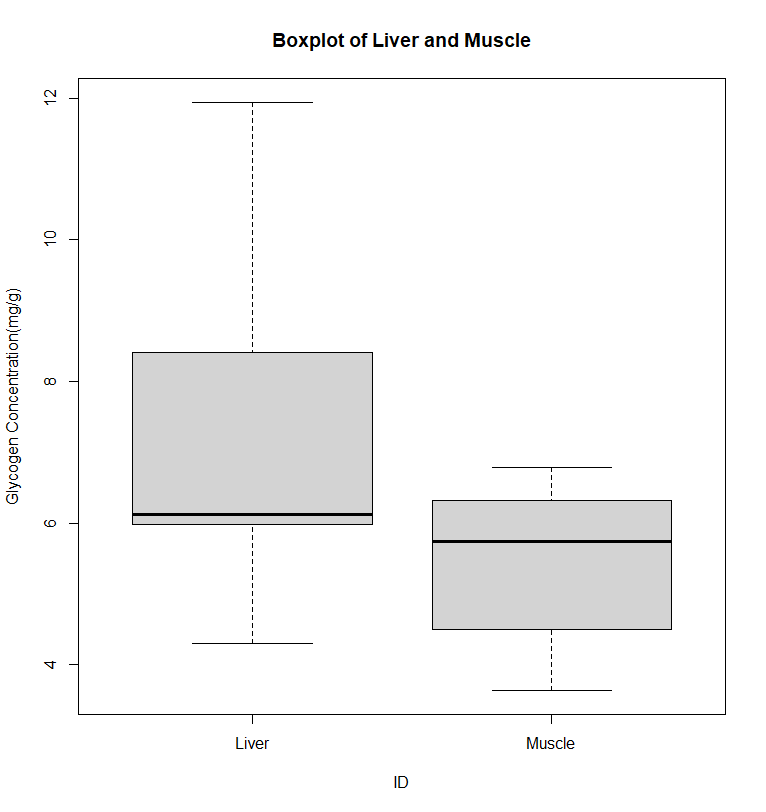
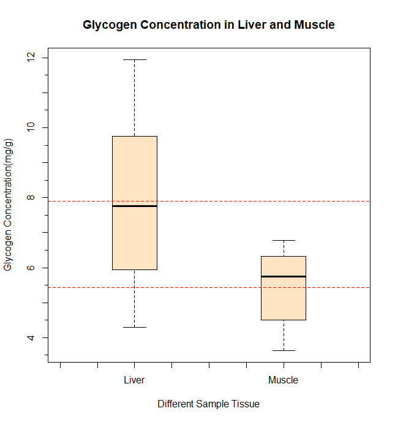

# 1.输入数据并计算糖原含量.
$$
糖原浓度=\frac{0.555*A_1}{A_0W}
$$

$$
其中~A_0:标准液吸光度~~A_1:待测上清液吸光度~~W:样本鲜重
$$

# 2.在Sample组内和tissue组内进行数据清洗.
## Sample组内数据清洗
###### 异常值的存在会对数据的计算分析过程产生影响，因此如果能体现与筛选异常值，分析其产生的原因，就可以发现问题并进而进行改进。识别异常值的经典方法中3σ法则和z分数法都是以数据服从正态分布为前提进行筛选的，而箱线图的绘制是依靠实际数据，不需事先假定数据服从的分布形式，同时因为四分位数具有一定的耐抗性，所以利用箱线图识别异常值的结果会比较客观。

### 利用箱线图检查Sample组内数据，结果如下

### L1，L2，L3Sample内差距较大，舍去不合理数据后，结果如下

## Tissue组内进行数据清洗
### 考虑到因取样位置的不同对糖原含量的影响，仅舍去不合理操作组L4数据，结果如下

# 3.结果输出
### 得到糖原在肝脏和肌肉组织中浓度的箱线图

### 得到肝脏和肌肉样本的描述性统计数据
```text
> summary(Liver)
   Min. 1st Qu.  Median    Mean 3rd Qu.    Max.
  4.301   6.228   7.755   7.908   9.423  11.940

> summary(Muscle)
   Min. 1st Qu.  Median    Mean 3rd Qu.    Max.
  3.635   4.664   5.745   5.436   6.315   6.783
```
#### 根据结果显示 
1. 肝脏组织内糖原浓度均值为7.908mg/g,肌肉组织内糖原浓度均值为5.436mg/g;
2. 肝脏组织内糖原浓度高于肌肉组织内糖原浓度;
3. 肝脏组织的糖原分布差异较肌肉组织糖原分布差异较大;

##### 代码详见 https://github.com/Yirios/Data-Analysis-in-Biochemistry/branches

