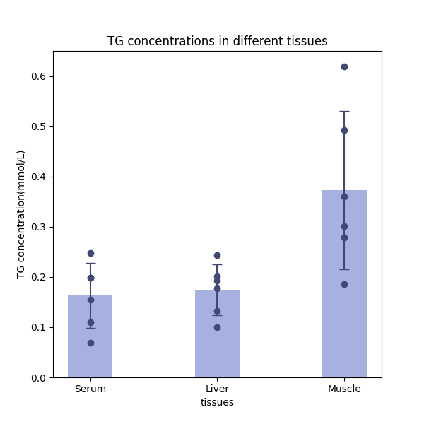

## Ex5 小鼠血清、肝脏和肌肉中甘油三酯含量

### 数据处理与画图

#### 数据清洗
由于数据的数目较少，这里直接通过人工观察的方式即可除去异常的数据点

#### 浓度计算
依据**朗博——比尔定律**可以计算得组织中的甘油三酯含量

$$
C_i= \frac{A_i-A_0}{A_s-A_0}C_s
$$

其中 $C_i$ 为样品管的甘油三酯浓度，$C_s$ 为标准管的甘油三酯浓度。
$A_i$, $A_s$, $A_0$,分别为样品管，标准管，空白管的吸光度。

#### 画图

### K-W平均秩检验（Kruskal-Wailis H）
未通过正态性和方差齐性检验，采取非参数检验的方式。

Kruskal-Wallis检验的思想是把n组样本混合起来成为一个数据集（即假设他们是来自同一个样本）,然后将数据从小到大编秩，每个数据在混合数据集中都有自己的秩；如果顺序位数相同，则取平均值作为秩。再然后求各组的平均秩次，如果这n组数据来自同一个样本，则应该各组的秩次和混合数据的总平均秩次相差不大，如果差异很大的话，则说明各组不是来自同一个总体。

|血清|肝脏|肌肉|p|
|:---:|:---:|:---:|:----:|
|√|√|√|0.0191146489820851|
|√|√||0.8725590308923732|
|√||√|0.0161224153433004|
||√|√|0.0163091718777549|

可见，血清与肝脏的甘油三酯含量差异不大，而肌肉中的甘油三酯含量有明显差异（p<0.05）

